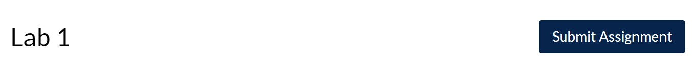

```{r setup, include=FALSE}
knitr::opts_chunk$set(echo = TRUE)
```

# Instructions

Welcome to Lab 4! Complete the following exercises designed to help get you up and running in R and RStudio. It is important that you keep your answers inside the ".answer" blocks. Do NOT delete the three colon blocks (:::) and keep your responses between them. Use the tutorial for help, and feel free to email your lab instructor or ask a question on Piazza.

Depending on your instruction method (synchronous or asynchronous), complete the following exercises collaboratively.

1. **Synchronous remote:** You will be placed in a Zoom breakout room to work together in small groups.
1. **Asynchronous remote:** Use Piazza for asynchronous collaboration.

**Collaborators:** If applicable, replace this text with the names of anyone you collaborated with on this project.

# Lab Assignment

## Background 
This week, we'll be using a [data set](https://github.com/rfordatascience/tidytuesday/blob/master/data/2020/2020-07-07/readme.md) from the Coffee Quality Database collected from the Coffee Quality Institute's [review pages](https://database.coffeeinstitute.org/) in January 2018 by BuzzFeed data scientist [James Ledoux](https://github.com/jldbc/coffee-quality-database). The data are available to you in `coffee_ratings.csv`. This data set describes how coffee is tasted, with the variable `total_cup_points` being the overall rating of the coffee.

You might find useful the below descriptions of some of the variables (from <https://www.coffeereview.com/interpret-coffee/>)

- **Aroma** refers to smell: "How intense and pleasurable is the aroma when the nose first descends over the cup and is enveloped by fragrance?"
- **Acidity** "is the bright, dry sensation that enlivens the taste of coffee"
- **Balance** "appears to mean that no one quality overwhelms all others, but there is enough complexity in the coffee to arouse interest."
- "**Body** and mouthfeel describe sensations of weight and texture. Body can be light and delicate, heavy and resonant, thin and disappointing; in texture it can be silky, plush, syrupy, lean or thin.
- "**Flavor** and **aftertaste** include everything not suitably described under the categories aroma, acidity and body.
- **Clean cup** is referring to the absence of non-coffee tastes or aromas in the cup.
- **Cupper points** are an individual rater's holistic perception of the cup.
- **Total cup points** is the sum of the ratings for flavor, aroma, aftertaste, acidity, body, balance, uniformity, sweetness, "clean cup", and cupper points.

Here's some more information about coffee tasting that you might find interesting: <https://www.coffeeiq.co/en/a-look-at-coffee-tasting/>. **You should feel empowered to find external resources which might help you further understand the data.**

## Question 1

:::{.question}
Read the data into R. You'll need to give the name of this file (*in quotes!*) to `read.csv()`, and call the data.frame `coffee` (if you don't do this, you WILL get errors later). Be sure to set `stringsAsFactors = TRUE`! The data are in a file called `coffee_ratings.csv`. 
:::

:::{.answer}
```{r question1, error = T}
# Use this code chunk to write the code necessary to answer the question. Do not start your code on this line, and do not start your code with # (this is a comment, R will ignore it).

```
:::

## Question 2
:::{.question}
Subset the data to include only the variables `total_cup_points`, `acidity`, `body`, and `balance`. Call this subset `coffee_numeric`. Verify your code worked by peeking at the new data set you created.
:::
:::{.answer}
```{r question2, error = T}
# Use this code chunk to write the code necessary to answer the question. Do not start your code on this line, and do not start your code with # (this is a comment, R will ignore it).

```
:::

## Question 3
:::{.question}
The variables `total_cup_points`, `acidity`, `body`, and `balance` are all numeric variables. What is the minimum of each of these variables? What is the maximum of each of these variables? Write your code below to find these values.
:::

:::{.answer}
```{r question3, error = T}
# Use this code chunk to write the code necessary to answer the question. Do not start your code on this line, and do not start your code with # (this is a comment, R will ignore it).

```

(Replace the blanks below with your answers **in bold**)

`total_cup_points` has a minimum of ___ and a maximum of ___.
`acidity` has a minimum of ___ and a maximum of ___.
`body` has a minimum of ___ and a maximum of ___.
`balance` has a minimum of ___ and a maximum of ___.
:::

## Question 4

:::{.question}
Create a correlation matrix of the variables `total_cup_points`, `acidity`, `body`, and `balance`. Which variable does the best job to predict `total_cup_points`?
:::

:::{.answer}
```{r question4, error = T}
# Use this code chunk to write the code necessary to answer the question. Do not start your code on this line, and do not start your code with # (this is a comment, R will ignore it).

```

(Replace the blanks below with your answers **in bold**)

The variable that does the best job to predict `total_cup_points` is ______________ and this is because ____________________________________________________________.
:::

## Question 5

:::{.question}
Make a scatterplot of `total_cup_points` and the variable you chose in Question 4. Is the relationship in fact linear?  Think hard about what the explanatory and response variables should be, using what you know about the variables (see the Background section above).
:::

:::{.answer}
```{r question5, error = T}
# Use this code chunk to write the code necessary to answer the question. Do not start your code on this line, and do not start your code with # (this is a comment, R will ignore it).

```

Write your answer to Question 5 here.
:::

## Question 6
:::{.question}
Fit a linear regression model to the data using the same variables as in Question 4 and 5. Remember that formula notation goes `y ~ x`: think hard about what's `y` and what's `x` when writing your code. What is our estimate of the population slope? What is the $R^2$ value?
:::

:::{.answer}
```{r question6, error = T}
# Use this code chunk to write the code necessary to answer the question. Do not start your code on this line, and do not start your code with # (this is a comment, R will ignore it).

```
(fill in your answer in the blanks, in bold)
The estimate of the population slope is __________.
The value of $R^2$ is _________.
:::

## Question 7
:::{.question}
In Question 5, you made a scatterplot of two variables. The `coffee` data contains a categorical variable called `color`, which represents the color of the coffee bean (before roasting; coffee's not brown until it's roasted!). Remake your scatterplot from Question 5, this time coloring the points according to the value of `color`. Make sure to include a proper legend.

**HINT:** You'll want to use the original `coffee` data set, *NOT* the `coffee_numeric` subset! Remember to check <http://www.stat.columbia.edu/~tzheng/files/Rcolor.pdf> for a list of valid color names ("Blueish-Green" is not one of them).
:::

:::{.answer}
```{r question7, error = T}
# Use this code chunk to write the code necessary to answer the question. Do not start your code on this line, and do not start your code with # (this is a comment, R will ignore it).

```
:::

<hr />
# Wrap-Up and Submission

At the top of the document, make sure you've changed the `author` field to your name (in quotes!). If you'd like, change the date as well.

When you've finished the lab, click the **Knit** button one last time.<br />


## Submission instructions
<!-- This is a comment and will not show up in your document. Note that the
numbering here is all 1's. This will automatically be converted to 1, 2, etc.
when you knit the document; writing all 1's makes it so you don't have to
constantly update the numbering when you move things around in editing! -->

  #### If you're using RStudio Cloud
  1. In the Files pane, check the box next to `lab04-report.html`: </br>
  
2. Click More > Export... </br>
  
3. Click Download and save the file on your computer in a folder you'll remember and be able to find later. You can just call the file `lab04-report.html` or whatever else you'd like (as  long as you remember what you called it). </br>
  

#### If you're using RStudio installed on your computer
1. Locate the `lab04-report.html` file on your computer. The file will be saved in the location indicated at the top of the files pane. <br>
  

#### Submission to Canvas

1. Click the "Assignments" panel on the left side of the page. Scroll to find "Lab 4", and open the assignment. Click "Submit Assignment". <br />
  

2. Towards the bottom of the page, you'll be able to choose `lab04-report.html` from the folder you saved it in from RStudio Cloud or noted if you're using RStudio Desktop. **You will only be able to upload a .html file -- do not upload any other file type.** <br />
  
3. Click "Submit Assignment". You're done!
